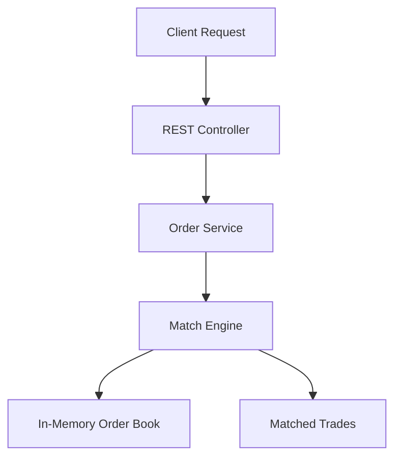
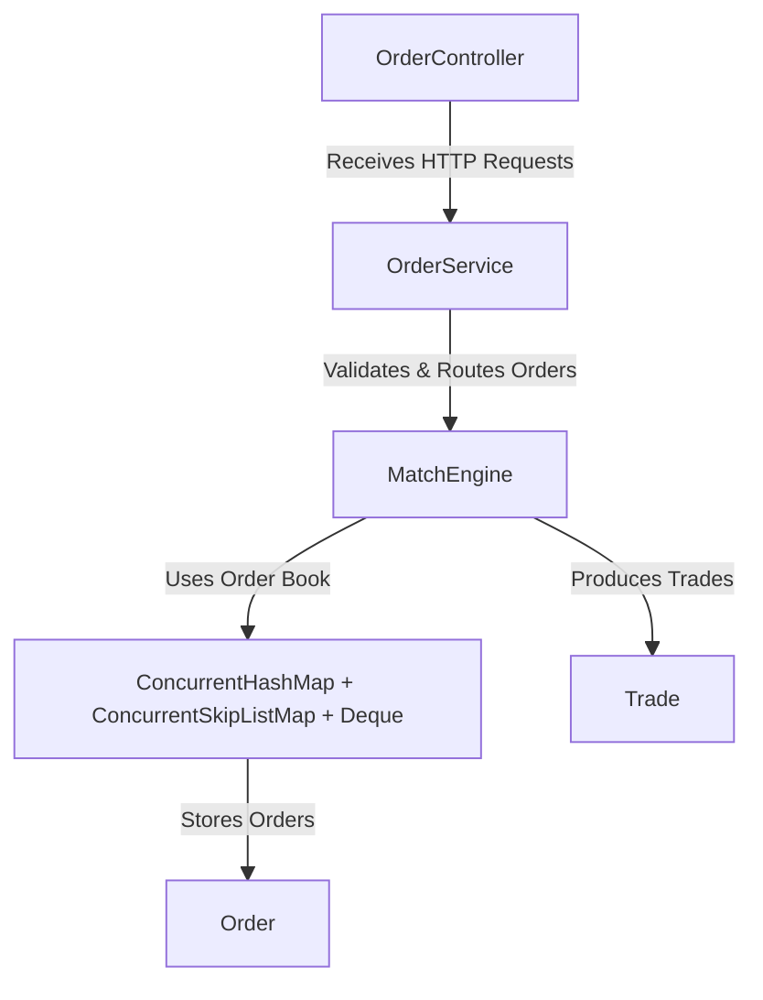
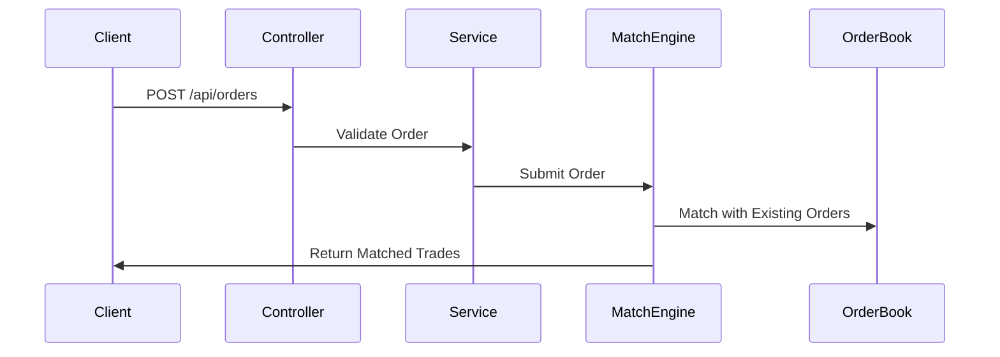

# Order Match Engine (In-Memory)


A high-performance **limit order matching engine** built using **Java 21** and **Spring Boot 3.4+**, 
designed to match buy and sell orders in real-time.  
This version uses **pure in-memory data structures** - **no persistence**, no database, and all state 
is lost after a restart.

---

## Features
- Supports **only limit orders**.
- **FIFO priority**:
    - **Highest bid wins** (max price for BUY, min price for SELL).
    - If two orders have the same price, the **oldest order** is matched first (FIFO).
- Concurrent order matching using **threads from the global thread pool**.
- **Whitelist-based asset validation** (configured in `application.properties`).
- Thread-safe and concurrent using **ConcurrentHashMap + ConcurrentSkipListMap + Deque**.
- Console logging for monitoring.
- Fully tested with **JUnit5** including multithreaded integration tests.
---

## Build and Run Instructions

### 1. Build
```bash
mvn clean install
```
### 2. Run Locally
```bash
mvn spring-boot:run
```
open http://localhost:8080/swagger-ui.html in browser to access the swagger endpoints
 
---

## Technologies Used
| Technology       | Purpose |
|------------------|---------|
| Java 21          | Core application |
| Spring Boot 3.4+ | Web framework and DI |
| Maven            | Build tool |
| SLF4J + logback  | Console logs |
| JUnit 5          | Unit and integration testing |


---

## API Endpoints

### Create Order
**POST /api/orders**  
Request:
```json
{
  "asset": "BTC",
  "price": 43251.00,
  "amount": 1.00,
  "direction": "SELL"
}
```

Response:
```json
{
  "id": 0,
  "timestamp": "2025-09-10T20:13:44.1304626Z",
  "asset": "BTC",
  "price": "43251.0",
  "amount": "1.0",
  "pendingAmount": "1.0",
  "direction": "SELL",
  "trades": []
}
```

### Get Order by ID
**GET /api/orders/{orderId}**  
Response:
```json
{
  "id": 2,
  "timestamp": "2025-09-10T20:15:56.3420024Z",
  "asset": "BTC",
  "price": "43253.0",
  "amount": "0.35",
  "pendingAmount": "0.0",
  "direction": "BUY",
  "trades": [
    {
      "orderId": 0,
      "amount": 0.35,
      "price": 43251
    }
  ]
}
```

---

## Key Decisions & Justifications

### 1. Why In-Memory Only?
Requirement clearly states:  
> *"Don't implement any persistence. All state will be lost after restart. That's okay."*

Therefore, **no database (even in-memory DB like H2)** is used. Orders and trades exist purely in JVM memory.

---

### 2. Thread Safety & Performance
- Used **ConcurrentHashMap**
    - To store oders for each asset
    - Efficient concurrent access and modification.
    - Efficient Locking
    - Thread Safe 
- Used **ConcurrentSkipListMap**:
    - Sorted map by price.
    - Efficient concurrent access and modification.
    - Provides natural ordering for matching.
- Used **Deque** inside each price level:
    - Maintains FIFO order for orders with the same price.
- **Fixed thread pool** ensures:
    - Multiple assets are matched **concurrently**.
    - reuses existing threads which avoids repeated creation/destruction of new thread.
    - Limits the maximum number of concurrent threads which prevents your system from being overwhelmed.
    - Tasks are queued and executed efficiently by worker threads.
    - Even if you get a sudden burst of requests, the pool manages them without spawning uncontrolled threads.
    - Can match concurrency to CPU level.
    - All these makes application more predictable under load.

---

## High-Level Design



---

## Low-Level Design

---

## Sequence Diagram



---

## Assumptions & Q/A

**Q:** Whether to use any random string as an asset in the match engine?  
**A:** We decided to allowlist valid assets (e.g., BTC, ETH, USDT) and reject others during order creation to ensure 
data integrity and reduce random inputs.

**Q:** How many precision points are used for price and amount?  
**A:** After reviewing examples, we assume 2 precision points.  
Both `price` and `amount` must be **>= 0.01** (positive values).  
Example: `100.25` (valid), `100.255` (invalid).

**Q:** Why no in-memory DB like H2?  
**A:** The requirement explicitly states not to implement persistence of any kind, so even in-memory DBs like H2 
are avoided. Orders and trades are maintained only in JVM memory and are lost on restart.

---

## Configuration

**application.properties**
```properties
# Whitelisted assets
ome.assets=BTC,ETH,USDT,TST

# Thread pool size 
ome.matchengine.thread-pool-size=5
```

---


